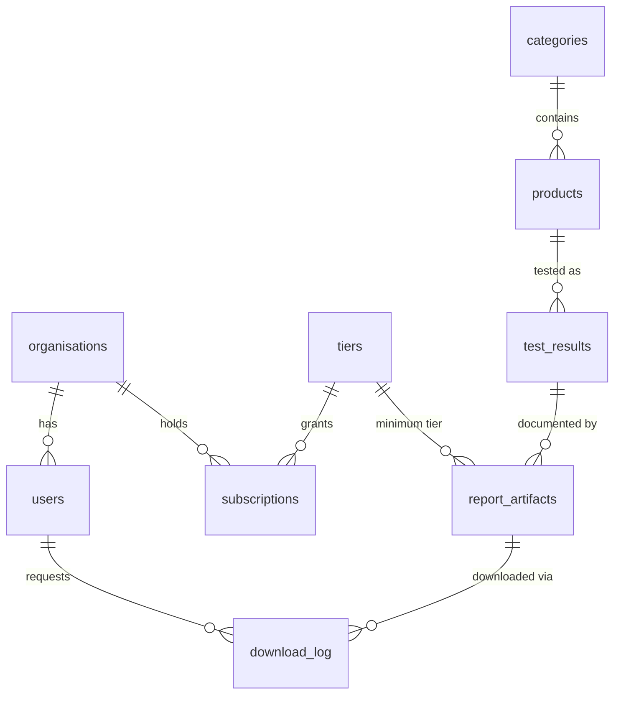

# Product testing dashboard

A single-page dashboard that shows product test results for one category (dishwashers), with subscription feature gating across three plans: Basic, Premium, and Enterprise. Built as a technical demonstration with Vue 3, TypeScript, Vite, and Apache ECharts.

**Live demo:** https://hamza-malikx.github.io/product-testing-dashboard/


## Quickstart

Needs Node 22.18 or newer (the exact supported range is pinned in the `engines` field of `package.json`). pnpm is the package manager used here (also pinned there), but npm works the same way.

```bash
pnpm install
pnpm dev          # dev server on http://localhost:5173
pnpm test:unit    # unit tests (Vitest)
pnpm build        # type check + production build
```

## Part A: how the frontend works

### One permission map drives all gating

Every plan maps to a set of named capabilities in [`src/config/tiers.ts`](src/config/tiers.ts):

| Plan       | Capabilities                                                          |
| ---------- | --------------------------------------------------------------------- |
| Basic      | `view:aggregates`                                                      |
| Premium    | + `view:charts`, `view:products`                                       |
| Enterprise | + `view:advanced-charts`, `download:reports`                           |

Components never check the plan name. They ask a question, like `can('download:reports')`. Moving a feature between plans is a one-line change in one file, and the test suite asserts what each plan must **not** be able to do. This mirrors how a server-side policy table would drive authorization in the real product (Part B, question 2).

### Locked views never receive real data

A `FeatureGate` component renders locked content as a frosted preview built from placeholder rows ([`src/data/decoyProducts.ts`](src/data/decoyProducts.ts)). Removing the blur in dev tools reveals fake brands and fake values, not the real ones.

One honest limit: the full JSON payload still ships inside the app bundle, because the brief asks for client-side parsing. So this pattern demonstrates the shape of the real control (components that may not show data are never handed it). It does not secure the demo. Real enforcement belongs on the server, and question 2 below describes that design.

### The numbers are treated as an API contract

The payload says 15 models were tested but lists only 3, and the average of the 3 listed scores (85.3) does not match the stated average (82.4). The UI therefore treats `aggregate_stats` as server-computed truth, never recomputes it, and labels product-level views "Showing top 3 of 15 tested products". The JSON is also validated at runtime ([`src/data/parsePayload.ts`](src/data/parsePayload.ts)), because TypeScript types are erased at runtime and outside data should never be trusted.

### Charts and the PDF report

Charts use Apache ECharts with per-module imports (`echarts/core`), so the bundle only carries the pieces in use. Premium unlocks the score chart; Enterprise adds the score vs time-to-result view.

Enterprise's "Download category report (PDF)" builds a real PDF in the browser (jsPDF), with both charts drawn as native vector graphics in the same design system as the app. The PDF code is split into its own chunk and loaded only on click, so other plans never even download it. In production this button would call an API that checks the caller's plan and returns a short-lived signed link (question 2).

### Deliberate omissions

- **No Pinia and no router.** One page and one piece of shared state; a composable holds it. A store earns its place when state grows (real sessions, several pages, server cache).
- **No dark mode.** Cut for scope. The palette lives as CSS custom properties in `src/assets/main.css`, which is where a dark theme would start.
- **Tests cover permission and data logic only.** The one page has no routing or async flows, so component tests would mostly be testing Vue itself.

## Part B: system design answers

### 1. Database schema

This platform is a shared catalogue with tiered entitlements. Every subscriber sees the same test results; the plan controls how much of them each organisation may see. So tenant isolation applies to tenant-owned tables (users, subscriptions, download logs), while access to the shared catalogue is checked per request against the organisation's subscription.



Key decisions, and why:

- **Plans are a lookup table, not an enum.** Plans change: prices, grandfathered deals, per-plan flags. A `tiers` table with a `rank` column supports "premium or higher" checks and new plans without schema migrations.
- **Subscriptions carry a validity date range**, and an exclusion constraint makes overlapping subscriptions for the same organisation impossible. The index behind that constraint also serves the hottest query in the system: "which plan does this organisation have today".
- **Metrics are a hybrid.** The two values every category shares (`score`, `ttr_days`) are typed, indexed columns. Protocol-specific measurements go into a JSONB column (JSON stored in a binary form the database can index), because each product category tests different things. When a JSON metric becomes something we filter or sort by, it is promoted to a real column.
- **Report files are private objects.** `report_artifacts` stores storage keys (never public URLs) plus the minimum plan required. `download_log` records every request, including denied ones, because denials are the interesting security signal.

Indexes that matter: `test_results (product_id, tested_at) INCLUDE (score, ttr_days)` lets the latest-scores lookup run as an index-only scan once the table's visibility map is current; `products (category_id)` because the dashboard is category-scoped; `download_log (org_id, requested_at DESC)` for usage and abuse queries. The full SQL schema, including the exclusion constraint and a row-level security example, is in [`schema.sql`](schema.sql).

### 2. API security: a malicious Basic user cannot reach Enterprise data

In this demo the whole payload goes to the browser, which is exactly the anti-pattern. In production, one request travels like this:

1. **Login issues a short-lived token** (about 15 minutes) holding only the user id and org id. The plan is deliberately not a token claim: the database stays the source of truth, so a downgraded organisation loses access immediately, not when a token expires. User membership itself is trusted for the token's lifetime; the short expiry bounds that window, and a revocation list can close it entirely if needed.
2. **Middleware resolves the entitlement on every request** from the subscriptions table (`WHERE org_id = $1 AND validity @> CURRENT_DATE`, served by the constraint index above).
3. **Routes deny by default.** A Basic token calling the product-level endpoint receives a 403 before any data query runs.
4. **Responses are built from allowlists.** The Basic endpoint runs `SELECT avg(score), count(*) ...` on the server; product rows are never selected, so there is nothing to strip and nothing to leak. Never fetch everything and filter afterwards: a blocklist is one refactor away from a leak.
5. **Downloads use signed, expiring links.** The IDs in this payload (`eval_889`, `eval_890`, ...) count upwards and are guessable, a classic IDOR setup (insecure direct object reference: guessing IDs to fetch objects you do not own). The download endpoint checks the organisation's plan rank against the report's minimum rank, writes an audit row, and only then returns a signed URL for that single object (a link that carries proof the server issued it and stops working after about 60 seconds). Guessing IDs yields 403s and an audit trail, not files.
6. **Defense in depth.** Parameterized queries only (values travel separately from the SQL text, so input can never become SQL); Postgres row-level security (the database itself filters rows by organisation) on tenant-owned tables as a backstop; per-user rate limiting; and an alert on bursts of 403s, because a Basic user probing Enterprise endpoints is a detection event, not just a denial.

The end state: a malicious Basic user with curl and a valid token can obtain no data beyond what an honest Basic user sees. The only extra things they collect are 403 responses and an audit trail.

### 3. Vetting AI-generated code

The two classes of defect I actively hunt for in AI-generated code:

**1. Missing authorization on generated endpoints.** Authorization failures fill the top of the OWASP API Security Top 10: broken object-level authorization is item one, and missing endpoint-level checks are item five. AI models learn from tutorials and quickstarts where auth is explicitly out of scope, so a prompt like "add an endpoint that returns products" yields an endpoint that returns products to anyone, and generated handlers do not reliably carry over middleware or tenant filters from neighbouring routes. The code works in the demo, so it survives review by execution. How I vet it: make authorization structural, not conventional (one mandatory entitlement middleware, so a forgotten check is impossible rather than unlikely); ship negative tests with every endpoint, asserting an anonymous or under-privileged caller gets 401/403 (test what must fail, not only what must succeed); add a static-analysis rule that flags any route handler outside the guard. This repo applies the same idea in miniature: the test suite asserts what each plan must not see.

**2. String-built SQL, and its performance cousin, the unbounded query.** String interpolation is everywhere in tutorial code, so models reproduce it, and it resurfaces exactly where naive parameterization is awkward (dynamic `ORDER BY`, search filters). Generated code also defaults to `SELECT *` with no `LIMIT`, which is fine on 3 rows and an incident on 3 million. How I vet it: parameterized queries or ORM bindings only; dynamic sort columns resolved through an allowlist map, never interpolated; semgrep or CodeQL in CI treating string concatenation adjacent to a query as a defect; pagination required on every collection endpoint.

Also on the watch list, one line each: hallucinated or stale dependencies (verify a package exists and is maintained before installing it, keep a lockfile and audit in CI), hardcoded secrets (gitleaks in pre-commit), permissive CORS defaults.

## Trade-offs and next steps

With more time this becomes: a real API with the entitlement middleware from question 2 and server-computed aggregates; login and organisation-level subscriptions; report downloads via signed URLs with audit logging; and usage telemetry on the locked-feature prompts, because knowing which gates get hit informs pricing. The client would then fetch tier-shaped responses instead of parsing a static payload, and the `selectDataForTier` seam is exactly where that swap happens.
